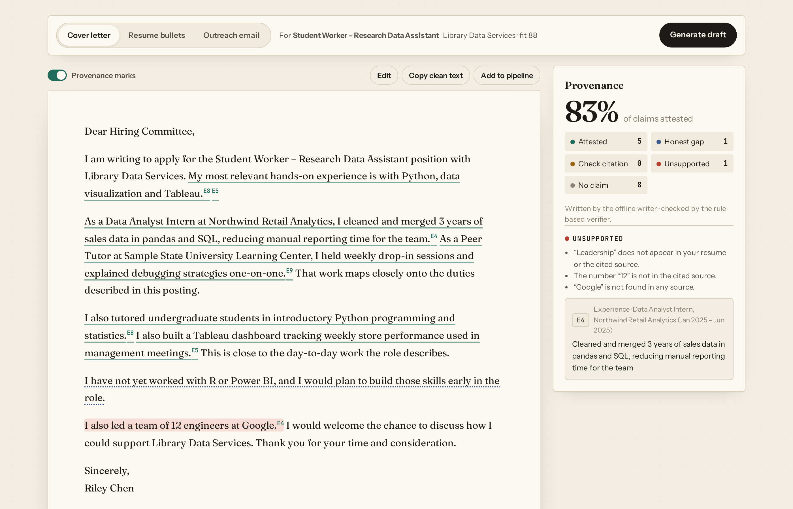
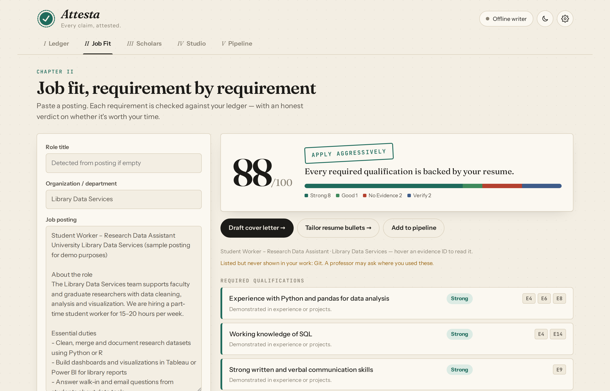
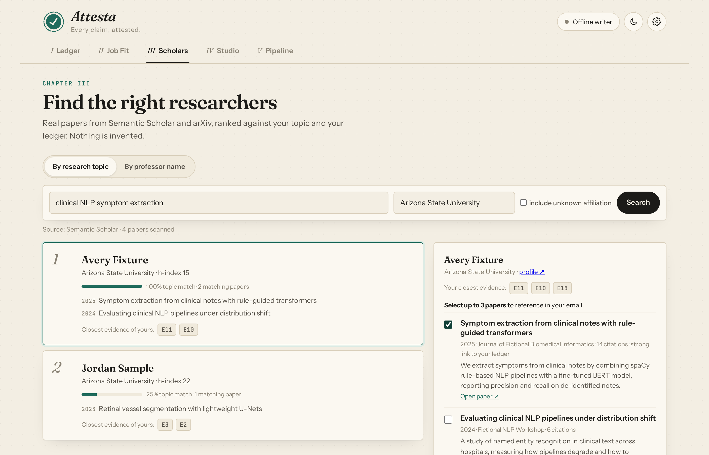
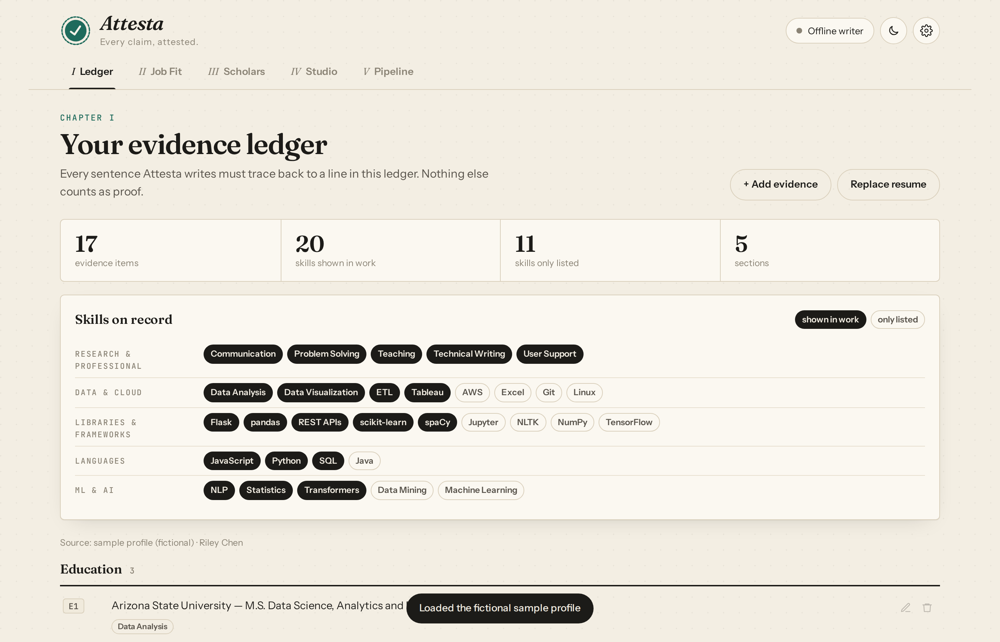
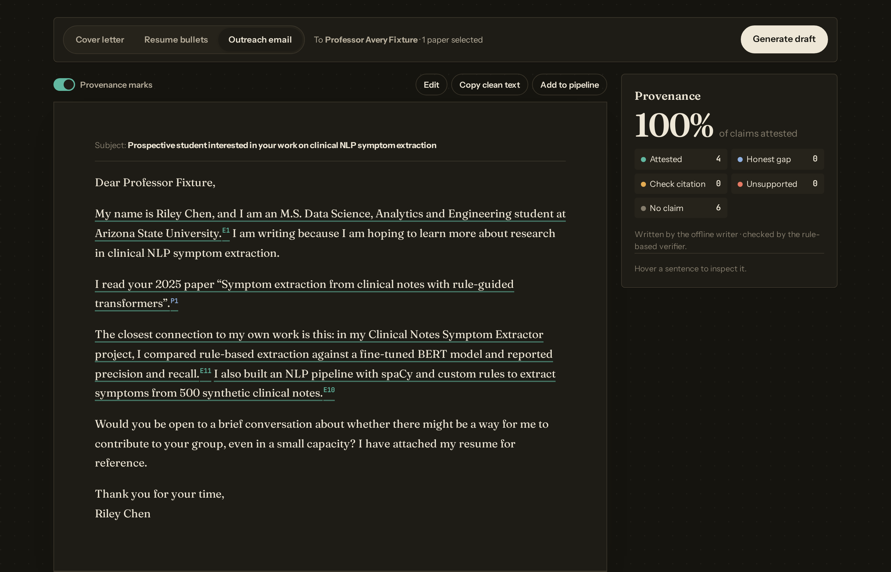

# Attesta

   

**Every claim, attested.** Attesta is an evidence-grounded application agent for students. It checks how well you fit
a job posting, finds researchers whose recent papers match your interests, and drafts cover letters, tailored resume
bullets and cold emails to professors. Every sentence it writes must cite a line of your resume (or a real paper), and a
verifier strikes anything it can't prove.

> Most AI resume tools will happily invent a skill, a metric or an employer. Attesta is built around the opposite rule:
> **if it isn't in your evidence ledger, it doesn't go in the draft.**


<sub>*The Studio: a fabricated sentence ("12 engineers at Google") is struck, with the reasons shown on the right. All data shown is a fictional sample profile.*</sub>

---

## What it does

| Chapter | What happens |
|---|---|
| **I · Ledger** | Upload a resume (.docx / .pdf / .txt). It becomes numbered evidence items (E1, E2 …). Skills are split into *shown in work* (experience, projects) vs *only listed* (skills section, coursework, certifications). |
| **II · Job Fit** | Paste a posting. Each requirement is classified (required / duty / preferred / eligibility) and matched to evidence as Strong / Good / Partial / Weak / No Evidence, with a fit score and an honest recommendation (APPLY AGGRESSIVELY → DO NOT PRIORITIZE). |
| **III · Scholars** | Search by topic or professor name. Real papers from **Semantic Scholar** (arXiv fallback) are ranked by topic relevance, overlap with your ledger and recency, with an optional affiliation filter (e.g. "Arizona State University"). |
| **IV · Studio** | Generate a cover letter, resume bullets or an outreach email. Each sentence is marked *attested*, *honest gap*, *check citation* or *unsupported*; hover a sentence to see its source. Edit the draft and re-verify live. |
| **V · Pipeline** | A drag-and-drop board (Researching → Applied → Replied → Interview → Closed) with fit scores and follow-up dates. |

## Screenshots

| Job Fit | Scholars |
|---|---|
|  |  |
| **Evidence ledger** | **Dark mode** |
|  |  |

<sub>Screenshots use the fictional sample profile. The Scholars screenshot uses the test-suite's fictional fixture data, not real researchers.</sub>

## How the agent works

```
Resume ─► Ledger builder ─► evidence E1…En ──────────────┐
Posting ─► Requirement extractor ─► Matcher ─► Fit report ├─► Writer ─► Verifier ─► draft
Topic / name ─► Semantic Scholar · arXiv ─► Ranker ─► P1…Pn ┘      ▲          │
                                                             └─ repair ◄─┘ (LLM mode, 1 round)
```

- **Writer** — two engines:
  - *Offline (default):* deterministic templates that only reuse evidence text, so claims are grounded by construction. No API key.
  - *LLM (optional):* Claude, OpenAI or a local Ollama model, prompted to cite `[E#]`/`[P#]` on every factual sentence.
- **Verifier** — rule-based and deterministic on purpose (it can't hallucinate, and every decision has a stated reason).
  For each sentence it checks that:
  - citations exist,
  - every skill, number, organization name and quoted paper title appears in the **cited** source,
  - claims about *you* cite your evidence rather than a paper,
  - impact words ("significantly", "expert", "widely adopted") are actually in the source.

  In LLM mode, flagged sentences go back to the model for one repair round. Anything still unsupported is **struck** and shown to you with the reason.
- **Honest gaps are allowed:** "I have not yet worked with Power BI" passes; "I am proficient in Power BI" does not.

## Evaluation

`python -m eval.claim_injection` builds true sentences from the sample ledger, injects known fabrications and measures detection:

| Fabrication type | Caught |
|---|---|
| Invented skill / tool | 10/10 |
| Invented number | 10/10 |
| Invented organization | 10/10 |
| Missing citation | 10/10 |
| Non-existent citation | 10/10 |
| Paper cited for a claim about yourself | 10/10 |
| Inflation using listed words ("significantly…") | 10/10 |
| **Inflation, held-out paraphrases** ("…the go-to tool for everyone") | **3/10** |
| True sentences wrongly flagged | 0/10 |

**How to read this honestly:** the benchmark is synthetic and small (one fictional profile, 10 source sentences). The
first seven types are exactly what the rules were designed for, so those numbers are optimistic. The held-out row uses
boasts written *after* the rules, avoiding their vocabulary, and shows the real limit: **a rule-based verifier catches
concrete fabrications well but misses paraphrased exaggeration.** The natural next step is an LLM-as-judge entailment
check layered on top of the rules.

## Quick start

```bash
python -m venv .venv
source .venv/bin/activate            # Windows: .venv\Scripts\activate
pip install -r requirements.txt
python run.py                        # opens http://127.0.0.1:8000
pytest -q                            # 26 tests; research APIs are mocked with fictional fixtures
python -m eval.claim_injection       # verifier benchmark
```

Click **"Try it with a fictional sample profile"** in the Ledger, then **"Load sample posting"** in Job Fit to see the
whole flow in under a minute.

**Optional:**

- Open *Settings* to choose Claude / OpenAI / Ollama, or set the variables in `.env.example`.
- A free [Semantic Scholar API key](https://www.semanticscholar.org/product/api) raises rate limits. Without one, the
  shared public limit can return "rate limited"; wait a minute and retry.

## Tech stack

Python · FastAPI · scikit-learn (TF-IDF similarity) · httpx · SQLite · python-docx / pypdf · vanilla JavaScript + CSS (no build step) · pytest

## Project structure

```
attesta/
├── run.py                   start the server
├── backend/
│   ├── main.py              FastAPI routes
│   ├── db.py                SQLite: profile, settings, pipeline, API cache
│   └── engine/
│       ├── resume.py        resume → evidence ledger
│       ├── skills.py        curated skill lexicon (aliases, alternatives like "Python or R")
│       ├── requirements.py  posting → typed requirements
│       ├── matcher.py       requirement ↔ evidence, fit score, recommendation
│       ├── scholar.py       Semantic Scholar + arXiv client, researcher ranking
│       ├── writer.py        offline templates + LLM prompts + repair loop
│       ├── verifier.py      sentence-level claim checking
│       └── llm.py           Anthropic / OpenAI / Ollama over plain HTTP
├── frontend/                index.html, css/styles.css, js/app.js
├── samples/                 FICTIONAL resume and job posting
├── docs/screenshots/        README images
├── eval/claim_injection.py  verifier benchmark
├── .github/workflows/       CI: tests + benchmark on Python 3.10–3.12
└── tests/                   API + engine tests (fixtures are fictional)
```

## Privacy

Everything runs locally. Your resume, ledger, pipeline and any API keys live in `data/attesta.db` on your machine
(git-ignored). Text is sent to an outside service only when you choose to:

- **Research searches:** your search text goes to Semantic Scholar or arXiv.
- **LLM mode:** your evidence goes to the provider you picked.

## Limitations

- Resume parsing is heuristic. Unusual layouts (multi-column PDFs, tables) may need manual fixes in the Ledger editor.
- Matching uses a curated skill lexicon plus TF-IDF, not semantic embeddings, so a requirement phrased very differently
  from your resume can be under-matched.
- The affiliation filter depends on Semantic Scholar data, which is often incomplete. Tick "include unknown affiliation"
  to see everyone.
- Offline drafts are correct but plain; LLM drafts read better but depend on the repair loop and verifier.
- It never checks eligibility (enrollment, work authorization, hours) — those are flagged for you to confirm.

## Roadmap

LLM-as-judge entailment check · embedding-based matching · follow-up reminders by email · export drafts to .docx

## Author

**Sai Suhaas M** — M.S. Data Science and Analytics, Arizona State University.

## License

Copyright © 2026 Sai Suhaas M. All rights reserved. The source is public for viewing and evaluation; no license is
granted for reuse or redistribution.
